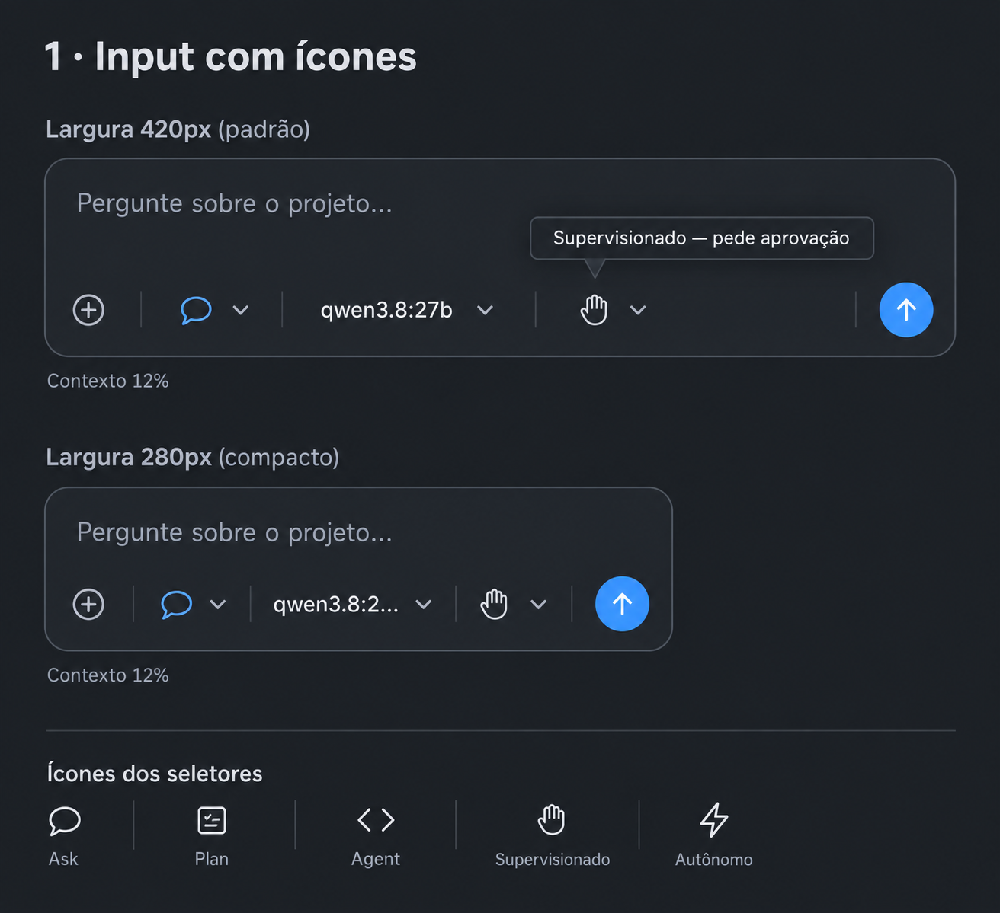
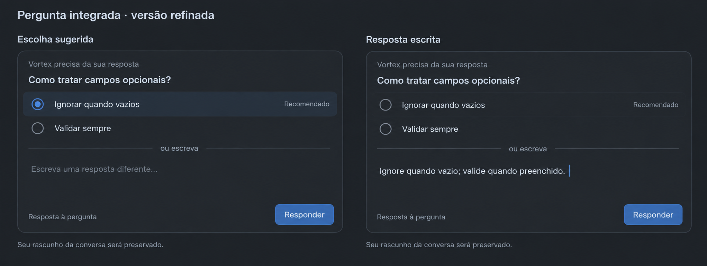
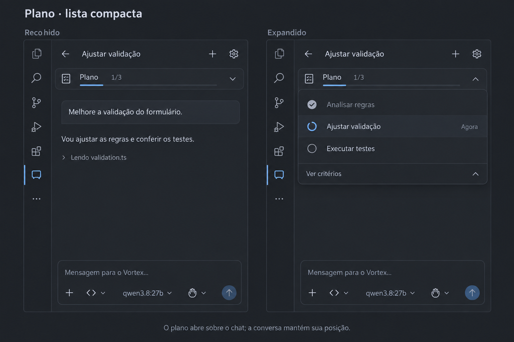

# Vortex — referências aprovadas e implementação

Referências aprovadas em 15/09/2026. Os PNGs originais foram copiados sem alterações; as capturas da implementação vêm da webview real, com dados simulados.

## 1. Input com ícones

[Captura implementada](implemented/input.png)

Uma caixa com contexto, modo, modelo, permissão e enviar/parar. Modo e permissão usam ícones e nomes acessíveis, com descrição no hover/foco e nos menus. O modelo permanece escrito. Ask/Plan preservam o indicador de somente leitura. O ícone Agent usa o símbolo de código do conjunto Lucide já utilizado pelo projeto.

## 2. Pergunta integrada

[Captura implementada — seleção](implemented/question-choice.png) · [Captura implementada — texto](implemented/question-written.png)

Durante `ask_user`, o composer contém pergunta, opções em linhas discretas, separador “ou escreva” e campo livre. Escolher uma opção limpa o texto; escrever desmarca a opção. Nada é enviado automaticamente. `Ctrl/Cmd+Enter` envia, `Shift+Enter` e Enter simples inserem uma linha. Cancelar interrompe a tarefa, sem conceder permissões.

`recommended_option` é opcional e deve corresponder exatamente a uma opção. A recomendação não marca a resposta. O contrato funciona nos cinco adaptadores e no protocolo de compatibilidade.

O rascunho normal e a resposta à pergunta têm estados separados. Troca de idioma e recriação da webview preservam a resposta enquanto o mesmo ID continuar pendente. Erros mantêm o conteúdo para tentar novamente. Uma pergunta pendente fica oculta no histórico por seu ID explícito; volta a aparecer após a interação, preservando o registro completo.

## 3. Plano compacto

[Captura implementada — recolhido](implemented/plan-collapsed.png) · [Captura implementada — expandido](implemented/plan-expanded.png)

Barra fixa abaixo do cabeçalho, inicialmente recolhida. O painel abre sobre o chat, sem mover mensagens, alterar a rolagem ou deslocar o composer. Cada etapa tem uma linha; clicar revela critérios, evidências e detalhes. Objetivo, versão e decisões permanecem acessíveis.

O painel tem rolagem própria e altura limitada a 45% da sidebar e ao espaço acima do composer. Cabeçalho, Escape ou clique fora fecham o painel. Abrir um seletor ou receber uma pergunta/aprovação também o recolhe. Atualizações do backend preservam foco e rolagem. A barra indica revisão ou resposta pendente, mesmo fechada.

Estados, contagem, aprovação, revisão e retomada continuam sob controle do backend. Checklists antigos mantêm sua identificação de legado.

## Validação desta entrega

- Compilação TypeScript e bundles concluída.
- 233 testes unitários passaram, incluindo recomendação nos cinco adaptadores, compatibilidade, validação de mensagens e estado local dos rascunhos.
- Testes de navegador passaram: 280/360/480 px, português/inglês, temas claro/escuro/alto contraste, fonte ampliada, teclas, erros, cancelamento e rascunhos.
- Regressões adicionais: plano de 50 etapas, geometria do chat idêntica antes/depois de expandir, cinco opções longas, ausência de recomendação implícita, resposta após recarga e descarte de mensagens inválidas.
- Extension Host real passou com provedores **simulados**: perguntas, aprovações, três etapas, verificação automática, revisão humana e recarga da janela. Os testes não dependem de respostas de um modelo real.

As referências e capturas não entram no VSIX, evitando aumentar o tamanho da extensão.
